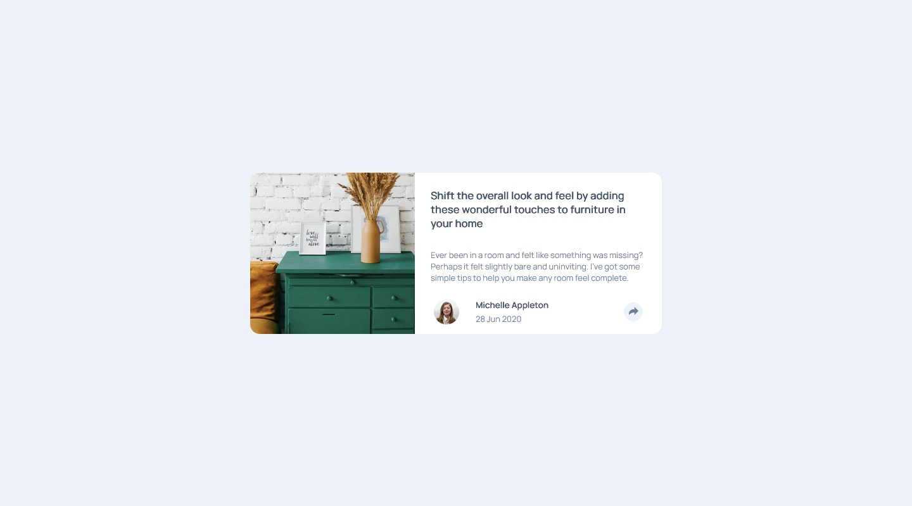

# Frontend Mentor - Article preview component solution

This is a solution to the [Article preview component challenge on Frontend Mentor](https://www.frontendmentor.io/challenges/article-preview-component-dYBN_pYFT). Frontend Mentor challenges help you improve your coding skills by building realistic projects. 

## Table of contents

- [Overview](#overview)
  - [The challenge](#the-challenge)
  - [Screenshots](#screenshots)
  - [Links](#links)
- [My process](#my-process)
  - [Built with](#built-with)
  - [What I learned](#what-i-learned)
  - [Continued development](#continued-development)
  - [Useful resources](#useful-resources)
- [Author](#author)

## Overview

### The challenge

Users should be able to:

- View the optimal layout for the component depending on their device's screen size
- See the social media share links when they click the share icon

### Screenshots




### Links

- [Solution](https://github.com/theGamingKitten/article-preview-component-master)
- [Live Site](https://thegamingkitten.github.io/article-preview-component-master/)

## My process

### Built with

- Semantic HTML5 markup
- CSS
- Flexbox
- Grid

### What I learned

Another approach to center the container in both directions, because the other solution with flexbox/grid wasn't always working as intended:

```css
.some-container {
/* center the container in both directions */
    margin: 0;
    position: absolute;
    top: 50%;
    left: 50%;
    transform: translate(-50%, -50%);
}
```

### Useful resources

- [Complete Guide to Grid](https://css-tricks.com/snippets/css/complete-guide-grid/) - very useful site about css grids, with which I'm still struggeling
- [w3schools](https://www.w3schools.com/css/css_tooltip.asp/) - used w2schools to implement the tooltip

## Author

- Frontend Mentor - [@theGamingKitten](https://www.frontendmentor.io/profile/theGamingKitten)